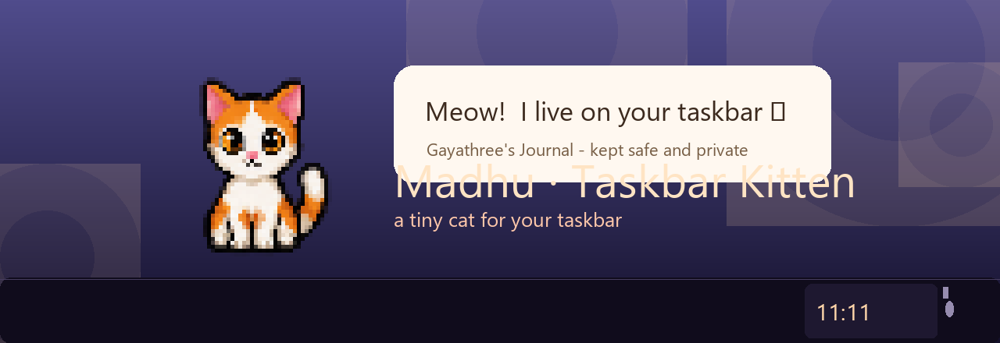
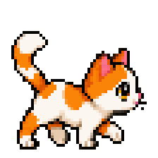

<div align="center">

# Madhu — Taskbar Kitten

### A tiny cat that lives on your Windows taskbar — and keeps a private journal for you.



[](#)
[](#)
[](#)
[](#)
[](#)
[](LICENSE)

**Madhu** is a personal project — a pixel-art companion who sits on your taskbar, naps,
stalks the bar when she's bored, purrs for your pets, wishes you luck, remembers your
milestones — and keeps a whole private journal for you, locked and safe.

---

**[⬇ Download KittySetup.exe](https://raw.githubusercontent.com/ramsathwik2/something-something-/main/KittySetup.exe)**
· No Python needed — everything is bundled.

**Read the full documentation:**
📄 [`Madhu_Documentation.pdf`](docs/Madhu_Documentation.pdf) ·
📖 [`ARCHITECTURE.md`](docs/architecture.md) ·
🧠 [`MASTER.md`](MASTER.md) (internal reference) ·
✨ [`FEATURES.md`](FEATURES.md) (feature spec)

</div>

---

## 🚀 Quick start (for her — no Python needed)

1. **Download** [`KittySetup.exe`](https://raw.githubusercontent.com/ramsathwik2/something-something-/main/KittySetup.exe).
2. **Run the installer** — it asks for a simple install folder and puts Madhu there.
3. If Windows SmartScreen complains: **More info → Run anyway** (the app is unsigned; it's fine).
4. **First launch:** a beautiful card asks *"what will you call her?"* — type a name
   (the default is **Madhu**) and press *That's my name* 🐾.
5. She appears on the taskbar! Right-click her for the menu, or use the 🐱 tray icon
   near the clock. That's it. 🎉

Her memory, journal and photos live in `%APPDATA%\TaskbarKitten\` — everything stays
on this machine.

> New version released? Just download and re-install — that *is* the update mechanism.

---

## 🐾 Features

| | | |
|---|---|---|
| 🖥️ **Taskbar companion** | She sits on the taskbar (`above` floating or `overlay` standing *on* the bar), walks along it when bored, and survives restarts. |  |
| 😴 **Real life** | Breaths while sleeping, naps, stretches, grooms, loafs, plays, blinks, wakes with a yawn. Sleeps earlier at night (22:00–06:00). | |
| 🐾 **Petting** | Click her or use *Pet Madhu <3* — hearts, purr, a happy hop, and milestones. | |
| 🍀 **150 luck messages** | *Wish me luck* from the menu or tray — architecture- & studio-themed encouragement rotated one by one. | |
| 📖 **The journal** | "Gayathree's Journal" — a book Madhu keeps for her: daily pages, moods, ratings, tags, photos, rich text (bold/italic/color/heading/todo), search, streaks, insights, dark mode. | |
| 🔒 **Private by design** | Optional password lock (Fernet + scrypt, min 6 chars), atomic saves, backups, `.bak` recovery — and export to TXT/PDF. | |
| 🔔 **Journal reminder** | Gentle nudge at a chosen time (default 21:00) to write the day. | |
| 🦆 **Duck mode (coding)** | When you're clearly working (VS Code, PyCharm, AutoCAD, Revit…), Madhu turns into a 96px rubber duck and stays out of the way. Manual toggle too. | |
| ☕ **Don't sleep 30m** | Heading for a deadline? Keep her awake and walking for 30 minutes. | |
| 🌠 **11:11 wish** | At 11:11 she reminds you to make a wish. | |
| 🎄 **Seasonal mood** | Christmas, Valentine's and Halloween surprises (15% chance, once a year). | |
| 📖 **Our story** | A scrapbook: days together, pet counts, milestones, longest time apart. | |
| 🔇 **Mute** | Sound off whenever you like — one little `meow.wav`, throttled, polite. | |

---

## 🛠️ Development

```bash
py -3.12 -m venv .venv
.venv\Scripts\activate
pip install -r requirements.txt
python src\app.py
```

**Dependencies:** `Pillow`, `psutil`, `pystray`, `cryptography` (Tkinter ships with Python).

**Tests** (need a desktop session with a display):

```bash
python _test_journal.py            # 16 checks — journal flows
python _test_lock.py               # 11 checks — password / encryption
python %TEMP%\opencode\test_walkfix.py    # 13 checks — walking lane
python %TEMP%\opencode\test_dontsleep.py  # 23 checks — don't sleep / duck / menu
```

---

## 🏗️ Architecture

| File | Purpose |
|---|---|
| `src/app.py` | Entry point — single-instance Win32 mutex, tray, activity monitor, main loop |
| `src/pet_window.py` | `PetWindow` — **all** UI, behaviors, journal, bubbles, sounds (~4,700 lines) |
| `src/animator.py` | `SpriteAnimator` — frame-selecting state machine |
| `src/taskbar.py` | Win32 taskbar geometry (rect, work area, edges, placement) |
| `src/activity.py` | `ActivityMonitor` — CPU / foreground-process polling (1 s) |
| `src/memory.py` | Persistent memory JSON (atomic writes, `.bak` recovery) |
| `assets/sprites/` | The pixel-art kit (56×56, plus 96×96 duck) |
| `assets/meow.wav` | The one and only sound |

One rule to remember: Tk runs on the main thread only — background threads must
marshall UI work through `pet.post_ui(...)`. Full details in
[`docs/architecture.md`](docs/architecture.md).

---

## 🔨 Building the installer

```bat
build_installer.bat        :: PyInstaller  -> dist\Kitty\Kitty.exe
iscc installer\kitty.iss   :: Inno Setup  -> KittySetup.exe
```

Both steps are wired in [`build_installer.bat`](build_installer.bat) and
[`installer/kitty.iss`](installer/kitty.iss), and the finished `KittySetup.exe`
is tracked in this repo so the raw GitHub link always serves the latest build.

---

## 🔒 Privacy

- **100% local.** No accounts, no telemetry, no network calls — the app never
  phones home.
- It only reads what it needs (taskbar geometry, foreground-window title to
  detect code/design tools, keyboard-idle time) and never stores or shares it.
- The journal and photos never leave `%APPDATA%\TaskbarKitten\`.

---

## 📜 License

[MIT](LICENSE) © 2026 — made with affection for one very special person.

**Credits:** the `meow.wav` is a CC0-licensed cat sound; everything else is
original pixel art and code built for this project.